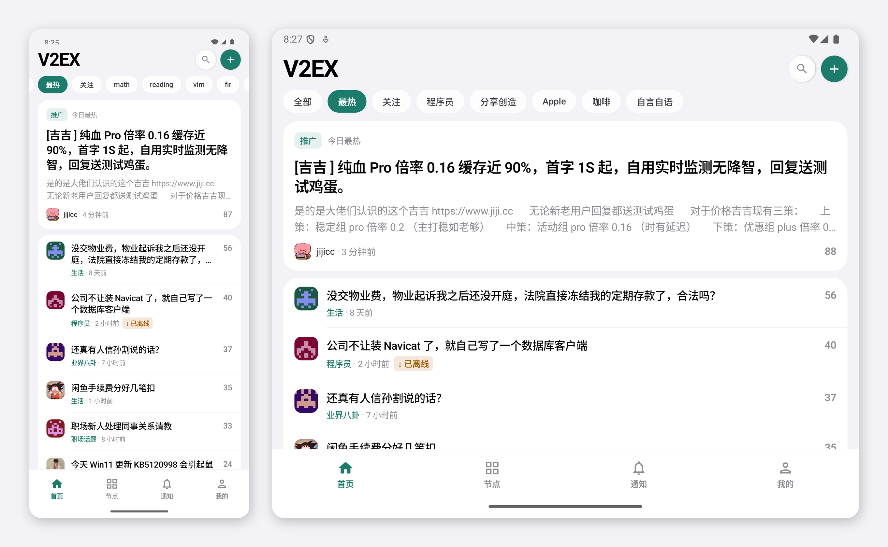

# V2EX for Android

面向个人使用的 V2EX Android 客户端。Kotlin + Jetpack Compose 构建， 数据来自 V2EX API（v1/v2）、网页会话和 sov2ex 搜索。




## 下载

📦 [最新版 APK 下载](https://github.com/xinghelee/v2ex-android/releases/latest)（Android 8.0+，Release 页附 SHA-256 校验值）

## 功能

### 浏览
- **首页**：全部 / 最热 / R2 / 关注 + 关注节点快捷分类横滑；公共信息流与节点支持连续分页、失败原页重试
- **话题**：正文与楼层回复渲染（段落 / 代码 / 引用 / 图片独立块）、楼层引用解析、只看楼主、**楼主附言**（网页抓取）、**浏览数**、PRO 徽章
- **节点**：1300+ 节点搜索（真实节点图标）、9 大分类目录、关注节点管理；无 Token 也可通过公开网页连续分页
- **帖内跳转**：正文、附言和回复中的 V2EX 帖子链接原生打开，返回继续阅读原帖；外部链接使用浏览器
- **用户主页**：资料卡 + 最近发布，话题页作者可直接点入
- **搜索**：话题 / 回复（sov2ex 全文索引，命中高亮）、用户（精确查询）、节点（本地过滤）；最近搜索持久化
- **阅读体验**：记住阅读进度（回帖楼层级）、已读话题置灰（可选）、打开过的话题记入浏览历史（30 天 / 500 条）

### 账号与数据
- **登录**：WebView 网页登录（验证码 / 2FA 由 V2EX 页面处理，密码不落盘）；Personal Access Token 配置（通知 / 资料 / 分页）
- **收藏**：话题页星标即收藏（未登录本地生效，登录态同步 V2EX）；登录后自动分页抓取网页收藏合并进本地
- **关注节点同步**：网页登录后，关注与取消关注通过节点页的收藏按钮同步官网，确认成功后更新本地；未登录时仍支持本地关注。网页关注节点自动导入可单独关闭
- **稍后读 / 离线**：整帖连回复存本地、离线可读；关注节点自动离线（仅 Wi-Fi 可选、30 分钟节流）
- **我的**：收藏 / 浏览历史 / 稍后读 / 我的话题 / 屏蔽管理，全部真实数据、可点入子页
- **内容与屏蔽**：按网页登录账号同步 V2EX 官网用户屏蔽名单；账号切换隔离缓存，官网确认后才更新；举报隐藏仍保存在本机
- **用户标记**：给用户加只有自己可见的标签，显示在帖子、回复和用户页；网页登录后可与浏览器插件 V2EX Polish 通过 V2EX 记事本双向同步，总开关可关
- **加密 DNS**：可选 DoH 解析（自动 / Cloudflare / Google / 阿里 / DNSPod / Quad9 / 自定义地址），每条线路可测试延迟；默认关闭，线路不通自动回退系统 DNS

### 互动
- **回复**：话题页行内回复条（安卓底部通栏形态），草稿自动保存、每层「回复」预填 `@user #楼层`、输入 `@` 弹参与者补全
- **发主题**：登录态 app 内直接发布（once + 表单，只认 `/t/<id>` 重定向为成功，未确认时查 API 兜底防重复发帖），成功直达新帖；未登录复制正文走网页
- **通知**：回复 / @ / 感谢分类，官网账号级未读角标与“全部已读”同步，点通知直达对应帖子
- **分享**：分享链接、**分享为卡片**（标题 / 作者 / 摘录 / 二维码的图片卡，经系统分享面板发出）、在 V2EX 打开

### 外观
- **5 套主题色**（翡翠绿 / 海洋蓝 / 绯红 / 琥珀橙 / 紫罗兰，HEX 逐一对齐）、明暗模式、字号 / 行距 / 等宽字体


## 技术栈

| 模块 | 实现 |
| --- | --- |
| UI | Jetpack Compose + Material 3，Navigation Compose（类型安全路由） |
| DI | Hilt |
| 网络 | Retrofit + OkHttp + kotlinx-serialization；API 2.0 信封解包；Jsoup 网页抓取（公开分页 / 收藏 / 屏蔽 / 通知 / 附言 / 发帖表单） |
| HTML | Jsoup 解析 `content_rendered` 为 ContentBlock 渲染树 |
| 图片 | Coil 3；二维码 ZXing core |
| 存储 | Room（草稿 / 收藏 / 历史 / 离线 / 举报隐藏）、DataStore（设置 / 阅读状态 / 最近搜索）、EncryptedSharedPreferences（PAT / 会话 Cookie）、按官网账号隔离的屏蔽缓存 |

## 构建

```bash
# 调试构建
./gradlew :app:assembleDebug

# 安装到已连接设备/模拟器
./gradlew :app:installDebug
```

要求：JDK 17+、Android SDK Platform 37。AGP 9.x 内置 Kotlin 支持（无需单独的 kotlin-android 插件）。

## 项目结构

```
app/src/main/kotlin/com/vibe/v2ex/
├── data/
│   ├── datastore/    # 设置、加密凭据、关注节点、已读状态、最近搜索、未读角标
│   ├── local/        # Room 实体与 DAO
│   ├── model/        # API 数据模型
│   ├── moderation/   # 官网屏蔽同步、内容过滤与举报 outbox
│   ├── nodes/        # 硬编码节点分类目录
│   ├── remote/       # V2EX v1/v2 API、sov2ex、网页会话（登录态抓取与表单提交）
│   └── repository/   # 收藏 / 历史 / 离线 / 自动离线协调器 / 话题 / 首页 / 节点 / 搜索 / 草稿
├── designsystem/     # 主题（5 套配色）、共享组件、HTML 渲染
├── di/               # Hilt 模块
├── feature/          # 按页面分包：home/topic/nodes/member/search/notifications/profile/write/...
└── navigation/       # 路由与 Tab 导航（通知未读角标）
```

## 说明

- 浏览话题和公开分页无需登录；通知、当前账号资料与 API 长帖分页需要 Personal Access Token（v2ex.com/settings/tokens）
- App 内回复、发主题、收藏同步需要网页会话（WebView 登录）；V2EX 无开放的写 API，写操作走与网页相同的表单
- 官网屏蔽名单和通知未读状态要求网页登录；通知列表还需要同一账号的 Personal Access Token
- API 频率上限 600 次/小时/IP，「关注」聚合与自动离线均采用串行请求控制配额
- 折叠屏：外屏与手机一致；展开态为拉伸单列，未做大屏双栏
- 崩溃日志只保存在本机（设置 → 关于 → 崩溃日志），不自动上传；反馈问题时可从那里复制或分享

[iOS 版本](https://github.com/xinghelee/v2ex)
